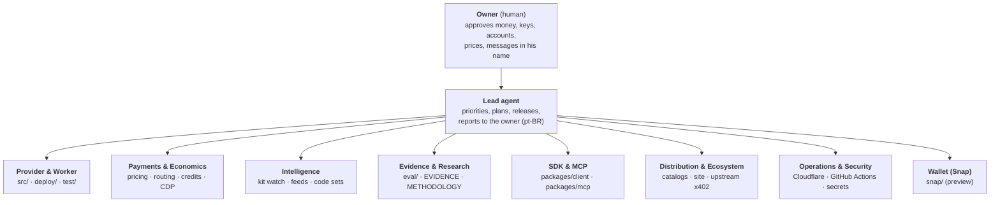

# AGENTS.md — x402check operating map

This is the map that every AI agent working on x402check reads first: Claude Code, Codex, Cursor or any other. It says:
- who owns what (the org chart);
- where everything lives;
- what to do when something happens;
- what is never allowed.

`CLAUDE.md` imports this file.

**Keep it current.** If you add or change an endpoint, a secret, a workflow, a catalog listing, a runbook or an owner, update this file in the same commit.

---

## 0. The product in one paragraph

**x402check** (`https://x402check.xyz`, `did:web:x402check.xyz`) is an x402 `risk-check` provider. Before an AI agent or a wallet pays, it checks the counterparty:
- the OFAC SDN list;
- phishing and drainer feeds;
- **its own kit watch** of drainer infrastructure on Ethereum and Base;
- transaction simulation;
- drainer-kit code;
- injected instructions in the content the agent acted on.

Every verdict is an ES256 attestation that states which checks ran. **Every check is paid; there is no free tier.**
- **Prepaid credits:** $0.001 a check.
- **Per call via x402:** priced by network, from $0.001 ($0.0035 on Base).
- **Simulated transaction:** $0.005.

The service runs as one Cloudflare Worker. The repository is `caiovicentino/jev-risk-check-provider` (MIT).

---

## 1. Org chart



One agent may hold several roles in one session. Know which lane you are working in, and respect its "done means".

| Role | Owns | Does | When | Done means |
|---|---|---|---|---|
| **Owner** (human) | Accounts: Cloudflare, npm org `x402check`, Coinbase CDP, GitHub, domain. Funds and keys. | Approves anything in §4 "Needs the owner". Creates keys and accounts, and signs 2FA with a macOS passkey. | On request. | He said yes, in chat. |
| **Lead agent** | Direction (`docs/STRATEGY.md`), releases (`CHANGELOG.md`, tags, GitHub releases), this file. | Sets priorities, splits work across the roles, verifies, and reports to the owner in **Brazilian Portuguese with correct accents**. | Every session. | Work verified in production, docs updated, the owner told plainly what changed and what is pending. |
| **Provider & Worker** | `src/` (provider core, scoring, landing, validation), `deploy/` (Worker, paid flow), `test/`. | Builds the API and the site. | Any code change. | All suites green (§3.1), deployed, `/healthz` shows the new version. |
| **Payments & Economics** | `deploy/pricing.ts`, the routing in `deploy/protected.ts`, `deploy/credits.ts`, `deploy/cdp.ts`. | Maintains prices, facilitator routing (CDP, PayAI, Dexter) and prepaid credits. Watches margins. | Fee changes, facilitator incidents, pricing work. | `/status` → `payments` shows every margin above 0, and `facilitators` are all ok. |
| **Intelligence** | Kit watch (`src/kit-watch*.ts`, `deploy/kit-watch.ts`, the per-minute cron), feeds (`scripts/update-*.ts`, `scripts/publish-feeds.ts`, `scripts/feeds-guard.mjs`, `.github/workflows/feeds.yml`, `deploy/scamsniffer-refresh.ts`, `src/never-flag.ts`), code sets (`scripts/kit-*.ts`, `hunt-kits.ts`, `legit-corpus.ts`). | Owns detection data: our own watch, lists and fingerprints. | The cron runs every minute and feeds refresh daily; also on new threat intel. | `/status` → `kit_watch` is `ok`, with lag 0, `gaps` not growing, `unbroken_since` not moving and `pending_reads` near 0. Every code set passed the collision gate. |
| **Evidence & Research** | `eval/`, `eval/evidence/*-report.json`, `docs/EVIDENCE.md`, `docs/METHODOLOGY.md`. | Measures, and publishes negative results too. Runs the paid production probes. | Every release that changes behaviour, and every public claim. | Numbers reproducible from the report, with Wilson CIs and externally grounded labels. |
| **SDK & MCP** | `packages/client` (`@x402check/client`, including the signing guard), `packages/mcp` (`@x402check/mcp`), `packages/mcp/server.json`, `scripts/publish-npm.sh`, `scripts/sync-decoders.mjs`. | Typed client, attestation verifier, **signing guard**, and the MCP server for agents. | API changes that affect clients, and releases. | Published on npm, installable with `npx`, and listed in the MCP Registry. |
| **Distribution & Ecosystem** | Catalog listings (§2.5), `deploy/discovery.ts` (Bazaar declaration, `/openapi.json`), `src/landing.ts`, `README.md`, upstream threads (§2.6), `docs/DISTRIBUTION.md` (drafts). | Keeps x402check wherever agents and their developers look. | After discovery-affecting changes, and weekly. | Each catalog shows current prices and endpoints (§3.5). |
| **Operations & Security** | Cloudflare (Worker `x402check`, KV `RATE`, Durable Object `CREDITS`, cron, secrets, analytics), GitHub Actions (`ci.yml`, `feeds.yml`, `publish-mcp-registry.yml`). | Deploys, monitors, responds to incidents, keeps secrets hygienic. | Every deploy and incident, and on anomalies. | Production healthy, and no secret in any output, log, commit or report. |
| **Wallet (Snap)** | `snap/` (MetaMask Snap 0.3.0). | Decodes locally and sends nothing. It is not published and not allowlisted, and it cannot pay yet. | Wallet work only. | `npm --prefix snap test` green. |

---

## 2. Where things are

### 2.1 Repository

| Path | What |
|---|---|
| `src/` | Provider core: `provider.ts` (evaluation and `PROVIDER_VERSION`), `scoring.ts`, `validate.ts`, `handler.ts` (routes the Worker does not special-case), `landing.ts` (the site and `og.png`), `jws.ts` (attestations, `request_hash`), `simulation.ts`, `kit-watch*.ts`, `sanctions.ts`, `domain-analysis.ts`, `icon.ts`, `never-flag.ts` (addresses no community list may flag: our `pay_to`, Permit2 and x402's proxies, the asset x402 charges in per network, major tokens), `data/` (embedded OFAC and MetaMask sets) |
| `deploy/` | Cloudflare Worker. `worker.ts` (routing, `/status`, cron, HEAD handling), `protected.ts` (paid flow, routing, stack, attestation-key check), `payment-claims.ts` (single use of each payment), `http-util.ts` (payer screening, settlement records), `pricing.ts`, `credits.ts`, `cdp.ts`, `discovery.ts`, `kit-watch.ts`, `feeds.ts` (GPL blobs from KV), `fresh-feeds.ts`, `wrangler.toml`. Details in `deploy/README.md`. |
| `packages/client`, `packages/mcp` | npm packages (`@x402check/client`, `@x402check/mcp`). The MCP server depends on the client via `file:../client` in the repo; publishing swaps it for `^version`. |
| `packages/client/src/guard.ts`, `packages/client/src/solana.ts` | **Signing guard** (`@x402check/client/guard`): `guardAccount` (EVM), `guardSolanaSigner` (Solana, with a dependency-free message decoder), `x402PaymentGuard`. The key signs only after a verified, bound `allow`. |
| `packages/mcp/src/pay.ts`, `packages/mcp/src/payer.ts` | **`x402check_pay`**: the MCP server pays an x402 resource only after the guard clears the exact option, inside `onBeforePaymentCreation` (`payer.payResource`). A `warn` goes to the user through MCP elicitation. |
| `packages/client/src/decode/` | The Snap's decoders, **vendored**: never edit them there. Edit `snap/src`, then run `node scripts/sync-decoders.mjs`. `test/decoders-sync.test.ts` fails on drift. |
| `snap/` | MetaMask Snap (preview). |
| `eval/` | Evaluations and paid production probes. Reports go to `eval/evidence/`. `paid-fetch.ts` pays with the probe payer, `flags.ts` parses the scripts' flags, `redact.ts` writes ScamSniffer-only entries as hashes (every report writer that handles that data uses it), and `replay.ts` probes single-use payments. |
| `scripts/` | `deploy.sh` (the only deploy path, §3.2), feed builders, `feeds-guard.mjs` (the feeds workflow's check before signing, plain node; §3.13), `sync-embedded-feeds.ts` (the embedded OFAC snapshot from the published release; `--check` for `deploy.sh`), kit-watch tooling, `publish-npm.sh`, `verify-attest.ts` (the SDK's verifier as a CLI: `--request`, `--max-age`, key pinned), `redact-evidence.ts` (`--check`: no ScamSniffer-only entry in the reports), `payai-shadow.ts`. **Money scripts:** `x402-pay.ts`, `sol-treasury-transfer.ts`, `gen-payer-wallets.ts` (see §4). |
| `docs/` | `STRATEGY.md` (direction), `METHODOLOGY.md` (verdict rules), `EVIDENCE.md` (measurements). The rest are historical records: `DISTRIBUTION.md` holds superseded drafts, `PR-PLAN.md` dates from 2026-09-27, and the `EVIDENCE-*` files and `hackathon/` are older. |
| `test/` | Provider tests (`npm test`). |
| `.github/workflows/` | `ci.yml` (push to main and PRs: provider, Worker bundle dry-run, Snap with a manifest-vs-rebuild check, client and MCP, production `npm audit`), `feeds.yml` (daily at 05:17 UTC → only the expected files are staged → the guard compares with the published release, OFAC address sets included → signed → `feeds` branch, with a hardened git), `publish-mcp-registry.yml` (tag `mcp-v*` → waits for green CI on that main commit → pinned, SHA-256-verified `mcp-publisher` → MCP Registry). Every action is pinned to a commit SHA and every token is least-privilege. |
| `.github/dependabot.yml` | Monthly version-update PRs, grouped (npm for the root, `packages/client`, `packages/mcp` and `snap`, plus GitHub Actions); each major update gets its own PR. |
| `SECURITY.md` | Vulnerability reporting (GitHub private reporting), scope, testing rules and the trust anchor. `/.well-known/security.txt` points to it. |
| `AGENTS.md`, `CLAUDE.md` | This map. |

### 2.2 Production endpoints (`https://x402check.xyz`)

| Endpoint | What |
|---|---|
| `POST /v1/risk-check`, `POST /v1/risk-check/batch` | Paid checks. Without payment the answer is a 402 challenge. `Authorization: Bearer x402c_…` pays from credits. A GET gets 405 with usage instructions. Each x402 payment is single-use (a copy gets 409 `payment_already_used`), an OFAC-listed payer gets 403 `payer_sanctioned`, and only x402 v2 payloads are processed. |
| `POST /v1/credits`, `GET /v1/credits` | Buy or top up credits (x402), and read a balance (bearer). |
| `GET /status` | Feeds (ScamSniffer with `refreshed_at` and `stale`), kit-watch coverage (aggregates only), `payments` (route and margin per network), `facilitators` (health and published signers), credits, `attestation` (kid, RFC 7638 thumbprint, self-check), `model` (the last canary and the model id the gateway reports). |
| `GET /healthz` | Version, deployed commit, and attestation-key health: 503 while the key cannot sign verifiable attestations (paid routes then refuse all work, with no charge). |
| `GET /openapi.json` | Discovery document read by x402scan and AgentCash. |
| `GET /.well-known/risk-check.json` | Discovery document for the risk-check extension (also served at `/` without `Accept: text/html`). |
| `GET /.well-known/did.json`, `/.well-known/jwks.json` | Attestation identity. |
| `GET /` (browser) | The site, served with a strict CSP (its one inline script allowed by hash). `/og.png?v=0.5`, `/icon.png` and `/favicon.ico` are the images. |
| `GET /.well-known/security.txt` | How to report a vulnerability (RFC 9116). |
| `GET /llms.txt`, `GET /.well-known/x402`, `GET /sitemap.xml` | Discovery for agents and crawlers: `llms.txt` (llmstxt.org) and `/.well-known/x402` (x402scan's compatibility format, `{version: 1, resources}`) are built from the OpenAPI document, so they list the same routes, prices and fields. No A2A agent card: x402check is not an A2A agent. |

Plain HTTP is never served: pages get a 301 to HTTPS and API calls a 403. Every response carries HSTS, `nosniff` and a `Referrer-Policy`.

### 2.3 Infrastructure

| System | Detail |
|---|---|
| Cloudflare | Worker `x402check`, deployed with `scripts/deploy.sh` (§3.2), using the wrangler pinned exactly in the root `devDependencies`. Workers Logs (`[observability]`) keep only the Worker's own error lines: invocation logs are off, so no request header (bearer token, `PAYMENT-SIGNATURE`) is stored. Zone settings (2026-09-30): minimum TLS 1.2, DNSSEC: the zone is signed (DNSKEY, RRSIG), but as of 2026-10-04 no DS is published at the `.xyz` registry (RDAP `delegationSigned: false`, no AD flag), so resolvers do not validate it; finishing it needs the owner's dashboard (DNS → Settings → DNSSEC, registrar Cloudflare) or a token with DNS settings access, CAA for the CAs Cloudflare issues with, SPF `v=spf1 -all` and DMARC `p=reject` (the domain sends no mail). Wrangler's OAuth token can only read the zone: zone changes need a zone-scoped API token from the owner. The zone is on the Free plan and Workers is on the **Paid** plan, which the cron needs (~250 ms of CPU per run, `cpu_ms = 30000`). |
| KV `RATE` | Kit watch (`kw:a:*`, `kw:delegates:*`, `kw:registry`, `kw:learned`, `kw:stats`, `kw:lease`, `kw:cursor:*`, and `kw:pending:*`: work queued for a later run (failed reads, delegates not yet probed, authorizations past 100 per delegate), at most 500 per chain; the watch writes at most 25,000 entries a UTC day; `kw:lease` holds the running cron's start time until its stats release it), the ScamSniffer blobs (GPL, runtime only), the last verified OFAC release for new isolates (`feed:ofac:v1`: signed manifest, signature and snapshot, re-verified on every load, written once per release), settlement records (`st:<network>:<tx>`, kept 400 days, for reconciling against the chain), and credits queued after a ledger failure (`pc:<settlement>`, applied by the cron; they hold the token's SHA-256, never the token). |
| Durable Object `CREDITS` | `CreditLedger`: one per credit token, named by the token's SHA-256. |
| Durable Object `PAYMENT_CLAIMS` | `PaymentClaim` (migration `v4`). One object per payment, named by the SHA-256 of what the payer signed (EIP-3009: network, asset, payer, nonce; Permit2: network, owner, nonce; Solana: the message bytes), never by the JSON spelling: each payment is single-use and kept 24 h. One per settlement transaction (`tx|network|hash`): a transaction pays once. One per payer (`payer:<address>`): at most 8 payments in flight, and 5 settlement refusals an hour hold the payer back. |
| Rate limit `UNPAID_LIMITER` | About 60 requests a minute per IP (Cloudflare's binding is approximate and counted per location: a short burst can pass) for unpaid requests to paid routes (or ones whose credential is malformed), balance reads (`GET /v1/credits`) and `/status`. |
| Rate limit `PAID_LIMITER` | About 300 requests a minute per IP for requests to paid routes that carry a well-formed credential (an x402 v2 `PAYMENT-SIGNATURE` or a `Bearer x402c_…` token, scheme case-insensitive). |
| Worker secrets (names only) | `AI_GATEWAY_API_KEY`, `JEV_ATTEST_PRIVATE_KEY`, `JEV_ATTEST_PUBLIC_JWK`, `CDP_API_KEY_ID`, `CDP_API_KEY_SECRET`, and, only during a key rotation, `JEV_ATTEST_NEXT_PUBLIC_JWK` (§3.12). |
| Worker vars | `PROVIDER_HOST`, `PAY_TO_EVM`, `PAY_TO_SOL`, and `GIT_COMMIT` (set by `scripts/deploy.sh`, shown in `/healthz`). |
| GitHub | The `feeds` branch holds the published feeds. The feeds workflow signs them with `FEEDS_SIGNING_KEY`, a secret of the `feeds` environment that only `main` may use. Repository settings (2026-09-30): private vulnerability reporting, Dependabot alerts and security updates, secret scanning with push protection; Actions limited to GitHub-owned actions pinned by SHA, with a read-only default token; rulesets `main` (no force-push, no deletion) and `release tags` (`v*`, `client-v*`, `mcp-v*`: no update, no deletion). There is no required-status-check rule: agents push straight to `main`, and `scripts/deploy.sh` and the registry workflow refuse a commit whose CI did not pass. The history was rewritten once on 2026-09-30 (§4); rewriting it again means disabling the `main` ruleset first, and needs the owner. |
| npm | Org `x402check`, owned by the owner. 2FA is a passkey: a publish needs his browser approval (§3.6). |
| MCP Registry | `io.github.caiovicentino/x402check`, published by the workflow through GitHub OIDC. |

### 2.4 Money

| What | Where |
|---|---|
| Revenue addresses (`pay_to`) | EVM `0xbF88b1F49B5e8Ec386289341c4a5ee00bB0E0178`, Solana `Bofhoe2ye2adNQwZJtLepeKrBZq8CtHzRwPJXgWDH69X` |
| Probe payer (eval spending) | EVM `0xB48057E647B2572f5eAe241b515fBc58B7cE249E`, about $0.18 of USDC on Base on 2026-10-02 (one `security:v5` run costs about $0.10). Its keys are in the owner's `~/.config/paysol/`, read only by `eval/paid-fetch.ts` and the money scripts. |
| Facilitators | Coinbase CDP (Base, Polygon, Arbitrum: $0.001 per settlement after 1,000 free a month), PayAI (Avalanche, Sei, and the EVM fallback: gas + 30%), Dexter (Solana, Monad: free). Live routing is in `/status`. |

### 2.5 Where x402check is listed

| Catalog | Listing | How it gets there |
|---|---|---|
| x402 Bazaar (Coinbase CDP) | `/v1/risk-check`, `/v1/risk-check/batch` | The route declarations in `deploy/discovery.ts`, plus a payment settled through CDP. Check with `PAY=none npx tsx eval/bazaar.ts`. |
| Agentic.Market (Coinbase) | Curated from the Bazaar | Nothing to submit. |
| x402scan | https://www.x402scan.com/server/14680ac3-396d-4174-b07d-9fae9bc74e96 | `/openapi.json`. Re-register after changing it (§3.5). |
| npm | `@x402check/client`, `@x402check/mcp` | §3.6 |
| MCP Registry | `io.github.caiovicentino/x402check` | A tag `mcp-vX.Y.Z` |
| awesome-jev | "Verification & Guardrails" | Merged PR (yibie/awesome-jev#293) |
| Not listed yet | Pay.sh (a Solana Foundation Typeform, with the owner's contact details), Smithery, Glama (`glama.json` is ready) | The owner submits on the web. |

### 2.6 Upstream and outreach threads

| Thread | State |
|---|---|
| x402-foundation/x402#3597 (our issue) | Open. We fixed a reviewer's `input_hash` point on 2026-09-29; waiting for them. |
| x402-foundation/x402#2422 (risk-check spec, not ours) | Stalled since May. The process wants a spec-only PR first and one language per PR. |
| x402-foundation/x402#2300 (trust-provider, not ours) | Active: participants are converging on a type-specific freshness anchor per evidence item. On 2026-10-01 we posted a live v0.6.1 attestation showing ours (OFAC release + SDN.XML digest, kit-watch `complete_through`); the PR author (vdineshk) agreed and cited our fail-closed rule. On 2026-10-02 we replied with the evidence rows for our kinds and `x402checkTrustProvider()` (`packages/client/src/trust-provider.ts`), which makes x402check a provider in their `providers[]`. On 2026-10-03 OceanAlt666 reproduced our OFAC digest independently and warned that OFAC's ticker labels are not chain discriminators; we replied with the check (8 mislabelled entries in the 10-02 list, all screen as listed; `test/sanctions-labels.test.ts`) and confirmed the sanctions `source` is the list artifact, one item per list. On 2026-10-04 Donk338 (Aegis, delivery evidence) independently confirmed the label edge case, called matching the canonical address and its encodings (our screen) "the only correct read", and proposed anchoring `delivery` evidence to a settled payment; everyone now waits for vdineshk's spec text, after which we align our field names (`x402checkTrustProvider`). Our account has commented 8 times; do not post without new substance. |
| PayAINetwork/docs#98 (our shadow proposal) | Opened 2026-09-29 with a week of Base replayed (0 flagged). On 2026-10-02 we followed up with a second Base week and a first Solana sample (`docs/EVIDENCE.md`, PayAI shadow): about 24,000 payments and $1,450 a week, 0 flagged, about $24 a week to screen everything; the pitch is the signed screening record, not detections. No reply yet; the PayAI team merges in that repo, so they see it. Do not follow up again without new substance (new chains, a real detection, or a change on their side). |
| solana-foundation/kora#682 (our issue) | Open, no reply yet. |
| romudille-bit/agentpay#9 (our proposal) | Opened 2026-10-01: screen the `pay_to` that `verified_route` (AgentPay's buyer-side x402 router) picks, as a signed evidence item. They agreed it fills a gap and sized it; we answered their trial-credit request with no free tier and the paid path ($0.10 = 100 checks, batch of 25). **On hold since 2026-10-02:** "verified_route usage is still early, and a pay_to screen makes more sense once there's real buyer volume behind the picks". The plan stays (screen their known `pay_to`s, act on high/critical or the hard categories), and they will come back on the thread when they run it. No reply needed; do not chase. |
| romudille-bit/awesome-x402#1 (our PR) | Opened 2026-10-01: x402check under Security & Audits. The list has been idle since March. |

---

## 3. When → do what

### Automatic cadences (no action unless something is off)

| Cadence | What runs | Watch |
|---|---|---|
| Every minute | Kit watch cron: new Ethereum and Base blocks, EIP-7702 delegations, kit deployments. The same cron applies queued credits (`pc:*`). | `/status` → `kit_watch` is `ok` (not `stale` or `degraded`): `lag_blocks` near 0, `gaps` not growing (it keeps the reads dropped before v0.6.2), `unbroken_since` not moving, `pending_reads` near 0 |
| Every 10 min per isolate | Facilitator routing: `/supported`, PayAI's `/pricing`, CDP reachability | `/status` → `payments`, `facilitators` |
| Daily at 05:17 UTC | `feeds.yml`: OFAC and MetaMask refresh → guard → `feeds` branch → the Worker refreshes in the background | `/status` → `refresh`; a failed run with `feeds guard` errors is a refused change (§3.13) |
| Every push to `main` | `ci.yml` | The GitHub Actions status |
| 05:37 and 17:37 UTC | Worker cron: the ScamSniffer domain and address sets are rebuilt into KV (GPL, runtime only), read at the upstream commit | `/status` → `data.scamsniffer.stale` is false; a refused refresh logs `scamsniffer refresh kept the previous data` (§3.13) |
| 06:07 and 18:07 UTC | Worker cron: the model canary (fixed cases through the live model) | `/status` → `model.canary.ok` is true and `stale` false |
| Monthly | Dependabot version-update PRs (grouped; majors one by one, except the planned migrations it ignores) | Review and merge like any change (§3.1) |
| Tag `mcp-v*` | `publish-mcp-registry.yml` | The run log, and the registry API |

### 3.1 Any code change

Run these before committing:

```bash
npm run typecheck && npm test                  # provider (and Snap typecheck)
npm --prefix packages/client test              # SDK
npm --prefix packages/mcp test                 # MCP (builds the client first)
npm --prefix snap run test:only                # Snap, against its built bundle
```

Commit messages end with the `Co-Authored-By` trailer that the session instructs.

### 3.2 Deploy

Push to `main`, wait for CI, then:

```bash
scripts/deploy.sh
```

It refuses unless the tree is clean, HEAD is `main` on GitHub, CI passed on it, and the embedded OFAC snapshot is not older than the published feeds release (run `npx tsx scripts/sync-embedded-feeds.ts`, commit and push first; `SKIP_FEEDS_CHECK=1` only in an emergency). It installs the locked dependencies without install scripts, deploys with the pinned wrangler, and sets `GIT_COMMIT`. A raw `wrangler deploy` is for emergencies only. To roll back, use `npx wrangler rollback`.

Then verify:
- `curl https://x402check.xyz/healthz` shows the version, the commit and `attestation_key: "ok"`;
- `/status` shows routes, facilitators all ok, and kit watch with lag 0 and gaps 0;
- `curl -H "Accept: text/html" https://x402check.xyz/` shows the site.

Local dev uses **port 8799**: `npm run dev:worker`.

### 3.3 Release

1. Bump the version in `src/provider.ts` (`PROVIDER_VERSION`), in `package.json`, and in `package-lock.json` (two root fields).
2. Sync the embedded OFAC snapshot with the published release: `npx tsx scripts/sync-embedded-feeds.ts` (it verifies the release as the Worker does and rewrites `src/data/ofac-sdn.ts` only when the published one is newer). A brand-new isolate screens against it until KV or the network gives it a newer one, and `scripts/deploy.sh` refuses an older snapshot.
3. Add a `CHANGELOG.md` entry, and update `README.md`, `docs/EVIDENCE.md`, `deploy/README.md` and this file as needed.
4. Push, wait for CI, deploy (§3.2) and verify.
5. `git tag -a vX.Y.Z`, push, then `gh release create vX.Y.Z --notes-file …`.

### 3.4 Evidence in production

Each paid probe spends from the probe payer to our own `pay_to`, or from its prepaid credits:
- `X402CHECK_BASE=https://x402check.xyz PAY_NETWORK=eip155:8453 npm run security:v5` costs about $0.10;
- `PAY_NETWORK=eip155:8453 npx tsx eval/replay.ts` costs $0.0035 (single-use payments);
- `npx tsx eval/bazaar.ts` costs $0.007 (`PAY=none` reads the listing only);
- `npx tsx eval/pay-guard.ts --n 25 --seed 402` costs $0.025 in credits;
- `npx tsx eval/guard.ts` costs nothing (in-process provider).

`security:v3` and `security:v4` are historical: against another version they stop before paying. Record the results in `docs/EVIDENCE.md` §7. Reports carry credit tokens only as a SHA-256 prefix, and ScamSniffer-only entries as hashes (`scripts/redact-evidence.ts --check`).

### 3.5 Catalogs

**After changing prices, routes or schemas:**
- Bazaar: `PAY=none npx tsx eval/bazaar.ts`. A new CDP-settled payment refreshes the listing.
- `npx -y @agentcash/discovery@latest discover https://x402check.xyz` must show 3 paid routes and no warnings.
- Re-register on x402scan:

  ```bash
  curl -X POST https://www.x402scan.com/api/trpc/public.resources.registerFromOrigin \
    -H 'content-type: application/json' -d '{"json":{"origin":"https://x402check.xyz"}}'
  ```

**x402scan's requirements:**
- an unpaid POST with no body must get a 402;
- `/favicon.ico` must answer HEAD.

### 3.6 Publish the npm packages (the owner's passkey)

1. Bump `packages/*/package.json`. For the MCP server, also bump both versions in `packages/mcp/server.json`.
2. Pack: in `packages/client`, run `npm pack`. In `packages/mcp`, set `@x402check/client` to `^<client version>`, run `node scripts/check-publish.mjs` then `npm pack`, and restore `package.json`.
3. Publish each tarball under a pseudo-terminal, so that npm offers the web 2FA link:

   ```bash
   sleep 900 | script -q /dev/null npm publish <tgz> --access public
   ```

   Run it in the background. Send the `https://www.npmjs.com/auth/cli/…` link to the owner, and kill the `sleep` when done.
   **The link expires on npm's side after about 5 minutes** (then `npm error 404 … /-/v1/done?authId=…`); the `sleep` only keeps the CLI waiting. Generate links only when the owner is at the keyboard and has said so; if one expires, run the publish again for a new link.
4. npm may hold a new version in **staged publishing** (placeholder `0.0.0-stage`). It releases itself, or the owner approves it under *Staged Packages*.
5. Verify with `npx -y --prefer-online @x402check/mcp@<v> --help`.
6. Tag `client-vX.Y.Z` and `mcp-vX.Y.Z` on a commit of `main` that passed CI. The `mcp-v` tag publishes to the MCP Registry; the workflow refuses a commit whose CI did not pass.

### 3.7 Payments incidents

- **A facilitator's fees or floors changed, or it is down:**
  - check `/status` → `payments` (margins) and `facilitators` (ok and HTTP status);
  - routing adapts on its own;
  - a negative margin is a pricing decision for the owner.
- **Rotate the CDP key:** the owner creates the key and runs `npx wrangler secret put CDP_API_KEY_ID` and `CDP_API_KEY_SECRET` in **his own terminal**. Then verify that `/status` → `facilitators` shows cdp ok and the Base route shows `cdp`.

### 3.8 Kit watch incidents

When `lag_blocks` grows, `gaps` grows or `unbroken_since` jumps forward, `pending_reads` stays high (a chain is `degraded` from 50), `dropped_today` grows, or a chain shows `error`:
- check `npx wrangler tail` and CPU time (Workers Paid);
- check the scan and read RPC endpoints (`SCAN_ENDPOINTS`, `READ_ENDPOINTS` and `BATCH_LIMITS` in `src/rpc.ts`);
- a queued item is retried for a day, then counted in `gaps`; the daily write budget resets at 00:00 UTC;
- `gaps` is never 0 again: it carries the 9,884 (Ethereum) and 2,090 (Base) code reads dropped before v0.6.2. Watch whether it grows;
- runs never overlap: a run holds `kw:lease` until the stats it writes last release it, and one that died holds it at most 5 minutes (a watch `stale` for longer than that is a real stall).

Never print or publish watchlist addresses, and never the queued reads (`kw:pending:*`).

### 3.9 Traffic analytics

The Cloudflare GraphQL API (`httpRequestsAdaptiveGroups`) works with the refreshed `wrangler` OAuth token. Filter on `requestSource: "eyeball"`: the Worker's own subrequests (facilitators, feeds, model) inflate the dashboard totals.

### 3.10 Upstream (x402-foundation/x402)

- **Commits:** they must be signed. Commits made through the GitHub API are verified. Use conventional commit messages.
- **PRs:** AI-assisted PRs open as **Draft** until the owner has reviewed them.
- **Listings:** the docs take no community listing PRs, so use the catalogs in §2.5.
- **New extensions:** a spec-only PR comes first, then implementations, one language per PR.

### 3.11 Outreach

Draft emails, DMs, forms and social posts. **The owner approves and sends them.** Comments in upstream threads are fine when they carry new substance, and they include the AI-assistance disclosure.

### 3.12 Attestation key incidents and rotation

- **`/healthz` answers 503 (`attestation_key: "misconfigured"`):** paid routes refuse all work, with no charge. `/status` → `attestation.reason` says why: a missing secret, a private key that does not match `JEV_ATTEST_PUBLIC_JWK`, or a failed canary signature. The owner fixes the secrets in **his own terminal**.
- **Rotation.** The SDK and the MCP server pin the key by thumbprint (`X402CHECK_KEY_THUMBPRINTS` in `packages/client/src/keys.ts`), so do it in this order:
  1. The owner creates the new P-256 key with a **new kid** (for example `jev-attest-v2`).
  2. Add its thumbprint to `X402CHECK_KEY_THUMBPRINTS`, keeping the old one, and release the client and the MCP server (§3.6).
  3. The owner runs `wrangler secret put JEV_ATTEST_NEXT_PUBLIC_JWK` with the new public JWK. It is then published in `jwks.json` and `did.json`. Wait at least 10 minutes for verifiers' caches.
  4. The owner swaps `JEV_ATTEST_PRIVATE_KEY` and `JEV_ATTEST_PUBLIC_JWK` to the new key, and sets `JEV_ATTEST_NEXT_PUBLIC_JWK` to the **old** public JWK, so attestations it signed stay verifiable until they expire (1 h).
  5. After 2 h, the owner deletes `JEV_ATTEST_NEXT_PUBLIC_JWK`. In a later client release, drop the old thumbprint.
  6. Check `/healthz` and `/status` → `attestation.thumbprint`.

### 3.13 A feed update was refused

Both refusals keep the data in use, so nothing breaks while you look.

- **The feeds workflow (OFAC, MetaMask).** The `publish` job printed `feeds guard` errors and signed nothing. The bounds (`scripts/feeds-guard.mjs`):
  - OFAC addresses shrink by more than 5% or grow by more than 50%;
  - any published OFAC address is missing from the new list (a delisting: only the count is printed);
  - MetaMask entries move by more than 20% either way;
  - a date goes backwards or runs more than a day ahead;
  - no published manifest or OFAC snapshot can be read, or a snapshot is not the one its manifest names.

  Check the upstream change (OFAC's recent actions, the MetaMask repository's commits). If it is legitimate, for example an OFAC delisting (compare the two `ofac-sdn.json` locally to see which addresses), run `gh workflow run feeds.yml -f override=true`. If it is not, find what broke the build: never override blind.
- **`feeds publish` errors** (the artifact "does not hold exactly the 5 expected files", or "an expected file is not a regular file"): the build produced something it never should (a `.git`, a symlink, an extra file). Nothing was signed or pushed. Treat it as a possible build compromise: inspect the build job's log and the dependencies it ran before re-running.
- **The ScamSniffer refresh.** Workers Logs show `scamsniffer refresh kept the previous data: <reason>`: a list halved, or grew by more than 50% or by more than 100,000 domains or 2,000 addresses. Look at the upstream commit. If it is legitimate, for example a large import, run `npx tsx scripts/update-threat-feeds.ts --scamsniffer --upload`, which has no growth bound.
- **`scamsniffer lists N never-flag address(es)`** in the logs means the list named an address from `src/never-flag.ts`. It was left out, so nothing is blocked; find out which entry it was and why.

---

## 4. Rules

### Never

- **Move funds.** The one exception is paid probes from the probe payer to our own `pay_to` (`eval/`, `scripts/x402-pay.ts`).
  - Never run `scripts/sol-treasury-transfer.ts` (it moves USDC to a configurable destination) without the owner's explicit OK.
  - Never run `scripts/gen-payer-wallets.ts`: it writes new keys over the funded ones.
- **A free tier, trial quotas or client-ID allowances.** Every evaluation is paid.
- **Commit or bundle GPL data.** ScamSniffer data and anything derived from it (code fingerprints, the kit registry) lives in runtime KV only.
- **Publish the kit-watch watchlist.** Public reports and `/status` carry aggregates only.
- **Expose a secret.** Never print, log or commit one: Worker secrets, GitHub secrets, `~/.config/paysol` keys, npm or CDP credentials, credit tokens. Reports carry token hashes only.
- **Touch processes on ports 8787–8789.** They belong to the owner's other apps. Local wrangler dev runs on 8799.
- **Quote a margin without the settlement fee.**
- **Claim a number without evidence.** Evidence needs externally grounded labels, held-out samples and Wilson CIs. Publish negative results, and correct errors publicly.

### Needs the owner

- New accounts, API keys, 2FA, and anything that costs money beyond the probe budget.
- Price changes.
- Messages in his name: email, DMs, forms, social posts.
- Deleting data, artifacts or published packages.
- Rewriting git history, force-pushing, or weakening the repository's rulesets and security settings (§2.3).

---

## 5. State as of 2026-10-03 (update when it changes)

- **Production:** v0.6.4 (2026-10-03, commit `edc8b00`): the second evaluation's fixes. A payment carries exactly one scheme payload, the one its route takes (a decoy next to it is refused), the payer is screened as signed (lowercase EVM; a Solana payer pays from its own token account), and address and chain must belong to the same family. The kit watch holds its lease for the whole run, signs `unbroken_since` and counts the 11,974 reads lost before v0.6.2 as gaps. New isolates screen against the last verified OFAC release from KV, the feeds publish job stages only expected files and refuses any OFAC delisting, and `/llms.txt`, `/.well-known/x402` and `/sitemap.xml` are served. Before it: v0.6.3 (2026-10-02), v0.6.2 the evaluation release (commit `c4a5f33`). A payment is single-use by what its payer signed (re-encodings included, proven in production with four spellings of one payment), payments are admitted before any work (payer readable and screened, validity window, per-payer in-flight cap and failure hold), every POST to a paid route is rate-limited, requests are strict (unknown fields, EIP-55, known chain ids), unpaid requests always get the 402 challenge, the kit watch retries and queues failed reads and signs `pending`, and the feeds are signed only after a plausibility guard. v0.6.1 (2026-10-01): every attestation signs a freshness anchor per evidence item — the OFAC SDN.XML release (`as_of` + `digest`, the file's SHA-256 as OFAC serves it), the kit watch's coverage (`complete_through` per chain, and `gaps`), the simulated block (`at_block`). v0.6.0, the audit release, was deployed on 2026-09-30 from commit `7d1e3ab` with `scripts/deploy.sh`.
  - Single-use payments, payer screening, a checked attestation key (with next-key rotation), HTTPS only, rate limits, Workers Logs and settlement records;
  - the model canary and the ScamSniffer refresh on the cron;
  - credits, per-network prices, routing across CDP, PayAI and Dexter, and the kit watch;
  - Bazaar and x402scan listings, `/openapi.json`.
- **Audit (2026-09-30):** no critical findings, 11 high. Every finding code can fix is fixed. What remains needs the owner: repository settings, DNS, the git history rewrite, npm names.
- **Packages:** `@x402check/client` 0.4.0 and `@x402check/mcp` 0.3.0 on npm (the MCP's display of the v0.6.1 anchors ships in its next release) (2026-09-30, tags `client-v0.4.0`, `mcp-v0.3.0`); the MCP Registry lists 0.3.0 as latest, published by the CI-gated workflow.
- **Solana signing guard** (`guardSolanaSigner`, since `@x402check/client` 0.3.0): decodes each transaction (lookup tables and token-account owners over RPC), refuses owner-change drains locally, and checks recipients, delegates and called programs. 4/4 on 1 real x402 payment and 3 constructed cases (`eval/solana-guard.ts`).
- **Guarded x402 payments** (`x402check_pay`, since `@x402check/mcp` 0.2.0): the MCP server pays a resource only after x402check clears the exact payee, right before signing. A `warn` goes to the user through elicitation.
  - One real payment through the tool settled on Base (`eval/mcp-pay.ts`), to x402check's own `pay_to`, a trusted payee that is not checked.
  - 25/25 real Bazaar payees were allowed, seed 402 (`eval/pay-guard.ts`); the earlier 24/25 was drawn with seed 0 by a parser bug.
- **Signing guard** (`@x402check/client/guard`): `guardAccount` and `x402PaymentGuard`. The agent's key signs only after a verified `allow` bound to the exact request.
  - Proof on real mainnet transactions (`eval/guard.ts`, v0.6.0): 22/25 drainer transactions that still move assets refused (10/11 contracts), and 0/49 legitimate ones that move assets (0/84 that execute; 1/228 in all, a reverting one too large to simulate).
  - In production from credits, 4/4 decisions agreed (both legitimate cases revert).
  - Probe credits: `~/.config/paysol/x402check-credit-token` (mode 600; never print it).
- **Revenue from outside:** $0.014, all from paying monitors on Base: `lumiere-paycheck-prober` bought one check and a batch of two on 2026-10-01 ($0.0105), and vet402's observatory (`vet402-observatory-l1`, which buys from Bazaar-listed endpoints to check that payment settles and the service delivers) bought one check on 2026-10-03 ($0.0035, settled by CDP; we delivered). Every other payment has come from our own probe wallets. Receipts land in the owner's wallet `0xbF88…0178` (confirmed his on 2026-10-02).
- **Evaluation (2026-10-02):** a security review of everything since the audit, an operations and cost review, and a black-box run in production. One high finding (the single-use claim keyed on the JSON spelling) and the rest are fixed in v0.6.2. Cost: about $5 a month (the Workers Paid base); the largest metric is CPU at about 31% of what is included. GitHub runs the scheduled feeds workflow late: it lands around 11:00 UTC, not 05:17.
- **Next** (`docs/STRATEGY.md`):
  - guard phase 3: custody-level enforcement (a co-signer, a smart-account module that checks the attestation on-chain, the Kora fee-payer gate);
  - measure the kit watch's lead time against public lists;
  - follow up with PayAI and CDP;
  - agent-framework integrations (AgentKit, Vercel AI SDK, ElizaOS);
  - a Snap that pays from credits.
