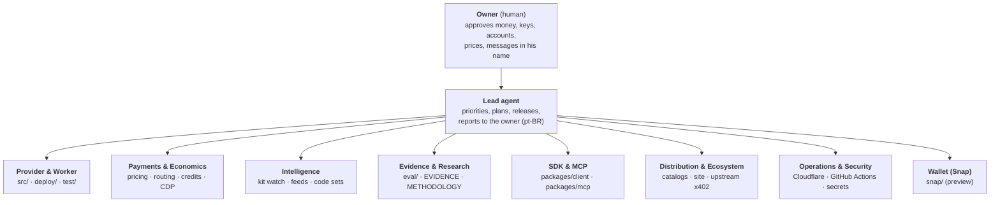

# AGENTS.md — x402check operating map

This is the map that every AI agent working on x402check reads first: Claude Code, Codex, Cursor or any other. It says:
- who owns what (the org chart);
- where everything lives;
- what to do when something happens;
- what is never allowed.

`CLAUDE.md` imports this file.

**Keep it current.** If you add or change an endpoint, a secret, a workflow, a catalog listing, a runbook or an owner, update this file in the same commit.

---

## 0. The product in one paragraph

**x402check** (`https://x402check.xyz`, `did:web:x402check.xyz`) is an x402 `risk-check` provider. Before an AI agent or a wallet pays, it checks the counterparty:
- the OFAC SDN list;
- phishing and drainer feeds;
- **its own kit watch** of drainer infrastructure on Ethereum and Base;
- transaction simulation;
- drainer-kit code;
- injected instructions in the content the agent acted on.

Every verdict is an ES256 attestation that states which checks ran. **Every check is paid; there is no free tier.**
- **Prepaid credits:** $0.001 a check.
- **Per call via x402:** priced by network, from $0.0035 on Base.
- **Simulated transaction:** $0.005.

The service runs as one Cloudflare Worker. The repository is `caiovicentino/jev-risk-check-provider` (MIT).

---

## 1. Org chart



One agent may hold several roles in one session. Know which lane you are working in, and respect its "done means".

| Role | Owns | Does | When | Done means |
|---|---|---|---|---|
| **Owner** (human) | Accounts: Cloudflare, npm org `x402check`, Coinbase CDP, GitHub, domain. Funds and keys. | Approves anything in §4 "Needs the owner". Creates keys and accounts, and signs 2FA with a macOS passkey. | On request. | He said yes, in chat. |
| **Lead agent** | Direction (`docs/STRATEGY.md`), releases (`CHANGELOG.md`, tags, GitHub releases), this file. | Sets priorities, splits work across the roles, verifies, and reports to the owner in **Brazilian Portuguese with correct accents**. | Every session. | Work verified in production, docs updated, the owner told plainly what changed and what is pending. |
| **Provider & Worker** | `src/` (provider core, scoring, landing, validation), `deploy/` (Worker, paid flow), `test/`. | Builds the API and the site. | Any code change. | All suites green (§3.1), deployed, `/healthz` shows the new version. |
| **Payments & Economics** | `deploy/pricing.ts`, the routing in `deploy/protected.ts`, `deploy/credits.ts`, `deploy/cdp.ts`. | Maintains prices, facilitator routing (CDP, PayAI, Dexter) and prepaid credits. Watches margins. | Fee changes, facilitator incidents, pricing work. | `/status` → `payments` shows every margin above 0, and `facilitators` are all ok. |
| **Intelligence** | Kit watch (`src/kit-watch*.ts`, `deploy/kit-watch.ts`, the per-minute cron), feeds (`scripts/update-*.ts`, `scripts/publish-feeds.ts`, `.github/workflows/feeds.yml`), code sets (`scripts/kit-*.ts`, `hunt-kits.ts`, `legit-corpus.ts`). | Owns detection data: our own watch, lists and fingerprints. | The cron runs every minute and feeds refresh daily; also on new threat intel. | `/status` → `kit_watch` has lag 0 and gaps 0. Every code set passed the collision gate. |
| **Evidence & Research** | `eval/`, `eval/evidence/*-report.json`, `docs/EVIDENCE.md`, `docs/METHODOLOGY.md`. | Measures, and publishes negative results too. Runs the paid production probes. | Every release that changes behaviour, and every public claim. | Numbers reproducible from the report, with Wilson CIs and externally grounded labels. |
| **SDK & MCP** | `packages/client` (`@x402check/client`), `packages/mcp` (`@x402check/mcp`), `packages/mcp/server.json`, `scripts/publish-npm.sh`. | Typed client, attestation verifier, and the MCP server for agents. | API changes that affect clients, and releases. | Published on npm, installable with `npx`, and listed in the MCP Registry. |
| **Distribution & Ecosystem** | Catalog listings (§2.5), `deploy/discovery.ts` (Bazaar declaration, `/openapi.json`), `src/landing.ts`, `README.md`, upstream threads (§2.6), `docs/DISTRIBUTION.md` (drafts). | Keeps x402check wherever agents and their developers look. | After discovery-affecting changes, and weekly. | Each catalog shows current prices and endpoints (§3.5). |
| **Operations & Security** | Cloudflare (Worker `x402check`, KV `RATE`, Durable Object `CREDITS`, cron, secrets, analytics), GitHub Actions (`ci.yml`, `feeds.yml`, `publish-mcp-registry.yml`). | Deploys, monitors, responds to incidents, keeps secrets hygienic. | Every deploy and incident, and on anomalies. | Production healthy, and no secret in any output, log, commit or report. |
| **Wallet (Snap)** | `snap/` (MetaMask Snap 0.3.0). | Decodes locally and sends nothing. It is not published and not allowlisted, and it cannot pay yet. | Wallet work only. | `npm --prefix snap test` green. |

---

## 2. Where things are

### 2.1 Repository

| Path | What |
|---|---|
| `src/` | Provider core: `provider.ts` (evaluation and `PROVIDER_VERSION`), `scoring.ts`, `validate.ts`, `handler.ts` (routes the Worker does not special-case), `landing.ts` (the site and `og.png`), `jws.ts` (attestations, `request_hash`), `simulation.ts`, `kit-watch*.ts`, `sanctions.ts`, `domain-analysis.ts`, `icon.ts`, `data/` (embedded OFAC and MetaMask sets) |
| `deploy/` | Cloudflare Worker. `worker.ts` (routing, `/status`, cron, HEAD handling), `protected.ts` (paid flow, routing, stack), `pricing.ts`, `credits.ts`, `cdp.ts`, `discovery.ts`, `kit-watch.ts`, `feeds.ts` (GPL blobs from KV), `fresh-feeds.ts`, `wrangler.toml`. Details in `deploy/README.md`. |
| `packages/client`, `packages/mcp` | npm packages (`@x402check/client`, `@x402check/mcp`). The MCP server depends on the client via `file:../client` in the repo; publishing swaps it for `^version`. |
| `snap/` | MetaMask Snap (preview). |
| `eval/` | Evaluations and paid production probes. Reports go to `eval/evidence/`. `paid-fetch.ts` pays with the probe payer. |
| `scripts/` | Feed builders, kit-watch tooling, `publish-npm.sh`, `verify-attest.ts`, `payai-shadow.ts`. **Money scripts:** `x402-pay.ts`, `sol-treasury-transfer.ts`, `gen-payer-wallets.ts` (see §4). |
| `docs/` | `STRATEGY.md` (direction), `METHODOLOGY.md` (verdict rules), `EVIDENCE.md` (measurements). The rest are historical records: `DISTRIBUTION.md` holds superseded drafts, `PR-PLAN.md` dates from 2026-09-27, and the `EVIDENCE-*` files and `hackathon/` are older. |
| `test/` | Provider tests (`npm test`). |
| `.github/workflows/` | `ci.yml` (push to main and PRs), `feeds.yml` (daily at 05:17 UTC → `feeds` branch), `publish-mcp-registry.yml` (tag `mcp-v*` → MCP Registry). |
| `AGENTS.md`, `CLAUDE.md` | This map. |

### 2.2 Production endpoints (`https://x402check.xyz`)

| Endpoint | What |
|---|---|
| `POST /v1/risk-check`, `POST /v1/risk-check/batch` | Paid checks. Without payment the answer is a 402 challenge. `Authorization: Bearer x402c_…` pays from credits. A GET gets 405 with usage instructions. |
| `POST /v1/credits`, `GET /v1/credits` | Buy or top up credits (x402), and read a balance (bearer). |
| `GET /status` | Feeds, kit-watch coverage (aggregates only), `payments` (route and margin per network), `facilitators` (health and published signers), credits. |
| `GET /healthz` | Liveness and version. |
| `GET /openapi.json` | Discovery document read by x402scan and AgentCash. |
| `GET /.well-known/risk-check.json` | Discovery document for the risk-check extension (also served at `/` without `Accept: text/html`). |
| `GET /.well-known/did.json`, `/.well-known/jwks.json` | Attestation identity. |
| `GET /` (browser) | The site. `/og.png?v=0.5`, `/icon.png` and `/favicon.ico` are the images. |

### 2.3 Infrastructure

| System | Detail |
|---|---|
| Cloudflare | Worker `x402check`, deployed with `cd deploy && npx wrangler deploy`. The zone is on the Free plan and Workers is on the **Paid** plan, which the cron needs (~250 ms of CPU per run, `cpu_ms = 30000`). |
| KV `RATE` | Kit watch (`kw:a:*`, `kw:delegates:*`, `kw:registry`, `kw:learned`, `kw:stats`, `kw:lease`, `kw:cursor:*`) and the ScamSniffer blobs (GPL, runtime only). |
| Durable Object `CREDITS` | `CreditLedger`: one per credit token, named by the token's SHA-256. |
| Worker secrets (names only) | `AI_GATEWAY_API_KEY`, `JEV_ATTEST_PRIVATE_KEY`, `JEV_ATTEST_PUBLIC_JWK`, `CDP_API_KEY_ID`, `CDP_API_KEY_SECRET`. |
| Worker vars | `PROVIDER_HOST`, `PAY_TO_EVM`, `PAY_TO_SOL`. |
| GitHub | The `feeds` branch holds the published feeds. The feeds workflow signs them with `FEEDS_SIGNING_KEY`, a repository secret. |
| npm | Org `x402check`, owned by the owner. 2FA is a passkey: a publish needs his browser approval (§3.6). |
| MCP Registry | `io.github.caiovicentino/x402check`, published by the workflow through GitHub OIDC. |

### 2.4 Money

| What | Where |
|---|---|
| Revenue addresses (`pay_to`) | EVM `0xbF88b1F49B5e8Ec386289341c4a5ee00bB0E0178`, Solana `Bofhoe2ye2adNQwZJtLepeKrBZq8CtHzRwPJXgWDH69X` |
| Probe payer (eval spending) | EVM `0xB48057E647B2572f5eAe241b515fBc58B7cE249E`, a few dollars of USDC on Base. Its keys are in the owner's `~/.config/paysol/`, read only by `eval/paid-fetch.ts` and the money scripts. |
| Facilitators | Coinbase CDP (Base, Polygon, Arbitrum: $0.001 per settlement after 1,000 free a month), PayAI (Avalanche, Sei, and the EVM fallback: gas + 30%), Dexter (Solana, Monad: free). Live routing is in `/status`. |

### 2.5 Where x402check is listed

| Catalog | Listing | How it gets there |
|---|---|---|
| x402 Bazaar (Coinbase CDP) | `/v1/risk-check`, `/v1/risk-check/batch` | The route declarations in `deploy/discovery.ts`, plus a payment settled through CDP. Check with `PAY=none npx tsx eval/bazaar.ts`. |
| Agentic.Market (Coinbase) | Curated from the Bazaar | Nothing to submit. |
| x402scan | https://www.x402scan.com/server/14680ac3-396d-4174-b07d-9fae9bc74e96 | `/openapi.json`. Re-register after changing it (§3.5). |
| npm | `@x402check/client`, `@x402check/mcp` | §3.6 |
| MCP Registry | `io.github.caiovicentino/x402check` | A tag `mcp-vX.Y.Z` |
| awesome-jev | "Verification & Guardrails" | Merged PR (yibie/awesome-jev#293) |
| Not listed yet | Pay.sh (a Solana Foundation Typeform, with the owner's contact details), Smithery, Glama (`glama.json` is ready) | The owner submits on the web. |

### 2.6 Upstream and outreach threads

| Thread | State |
|---|---|
| x402-foundation/x402#3597 (our issue) | Open. We fixed a reviewer's `input_hash` point on 2026-09-29; waiting for them. |
| x402-foundation/x402#2422 (risk-check spec, not ours) | Stalled since May. The process wants a spec-only PR first and one language per PR. |
| x402-foundation/x402#2300 (trust-provider, not ours) | Active. The owner has commented 4 times. Do not post without new substance. |
| PayAINetwork/docs#98 (our shadow proposal) | Open, no reply yet. |
| solana-foundation/kora#682 (our issue) | Open, no reply yet. |

---

## 3. When → do what

### Automatic cadences (no action unless something is off)

| Cadence | What runs | Watch |
|---|---|---|
| Every minute | Kit watch cron: new Ethereum and Base blocks, EIP-7702 delegations, kit deployments | `/status` → `kit_watch` has `lag_blocks` near 0 and `gaps` 0 |
| Every 10 min per isolate | Facilitator routing: `/supported`, PayAI's `/pricing`, CDP reachability | `/status` → `payments`, `facilitators` |
| Daily at 05:17 UTC | `feeds.yml`: OFAC and MetaMask refresh → `feeds` branch → the Worker refreshes in the background | `/status` → `refresh` |
| Every push to `main` | `ci.yml` | The GitHub Actions status |
| Tag `mcp-v*` | `publish-mcp-registry.yml` | The run log, and the registry API |

### 3.1 Any code change

Run these before committing:

```bash
npm run typecheck && npm test                  # provider (and Snap typecheck)
npm --prefix packages/client test              # SDK
npm --prefix packages/mcp test                 # MCP (builds the client first)
npm --prefix snap run test:only                # Snap, against its built bundle
```

Commit messages end with the `Co-Authored-By` trailer that the session instructs.

### 3.2 Deploy

```bash
cd deploy && npx wrangler deploy
```

Then verify:
- `curl https://x402check.xyz/healthz` shows the version;
- `/status` shows routes, facilitators all ok, and kit watch with lag 0 and gaps 0;
- `curl -H "Accept: text/html" https://x402check.xyz/` shows the site.

Local dev uses **port 8799**: `npm run dev:worker`.

### 3.3 Release

1. Bump the version in `src/provider.ts` (`PROVIDER_VERSION`), in `package.json`, and in `package-lock.json` (two root fields).
2. Add a `CHANGELOG.md` entry, and update `README.md`, `docs/EVIDENCE.md`, `deploy/README.md` and this file as needed.
3. Deploy (§3.2) and verify.
4. `git tag -a vX.Y.Z`, push, then `gh release create vX.Y.Z --notes-file …`.

### 3.4 Evidence in production

Each paid probe spends from the probe payer to our own `pay_to`:
- `X402CHECK_BASE=https://x402check.xyz PAY_NETWORK=eip155:8453 npm run security:v5` costs about $0.10;
- `npx tsx eval/bazaar.ts` costs $0.007.

Record the results in `docs/EVIDENCE.md` §7. Reports carry credit tokens only as a SHA-256 prefix.

### 3.5 Catalogs

**After changing prices, routes or schemas:**
- Bazaar: `PAY=none npx tsx eval/bazaar.ts`. A new CDP-settled payment refreshes the listing.
- `npx -y @agentcash/discovery@latest discover https://x402check.xyz` must show 3 paid routes and no warnings.
- Re-register on x402scan:

  ```bash
  curl -X POST https://www.x402scan.com/api/trpc/public.resources.registerFromOrigin \
    -H 'content-type: application/json' -d '{"json":{"origin":"https://x402check.xyz"}}'
  ```

**x402scan's requirements:**
- an unpaid POST with no body must get a 402;
- `/favicon.ico` must answer HEAD.

### 3.6 Publish the npm packages (the owner's passkey)

1. Bump `packages/*/package.json`. For the MCP server, also bump both versions in `packages/mcp/server.json`.
2. Pack: in `packages/client`, run `npm pack`. In `packages/mcp`, set `@x402check/client` to `^<client version>`, run `node scripts/check-publish.mjs` then `npm pack`, and restore `package.json`.
3. Publish each tarball under a pseudo-terminal, so that npm offers the web 2FA link:

   ```bash
   sleep 900 | script -q /dev/null npm publish <tgz> --access public
   ```

   Run it in the background. Send the `https://www.npmjs.com/auth/cli/…` link to the owner, and kill the `sleep` when done.
4. npm may hold a new version in **staged publishing** (placeholder `0.0.0-stage`). It releases itself, or the owner approves it under *Staged Packages*.
5. Verify with `npx -y --prefer-online @x402check/mcp@<v> --help`.
6. Tag `client-vX.Y.Z` and `mcp-vX.Y.Z`. The `mcp-v` tag publishes to the MCP Registry.

### 3.7 Payments incidents

- **A facilitator's fees or floors changed, or it is down:**
  - check `/status` → `payments` (margins) and `facilitators` (ok and HTTP status);
  - routing adapts on its own;
  - a negative margin is a pricing decision for the owner.
- **Rotate the CDP key:** the owner creates the key and runs `npx wrangler secret put CDP_API_KEY_ID` and `CDP_API_KEY_SECRET` in **his own terminal**. Then verify that `/status` → `facilitators` shows cdp ok and the Base route shows `cdp`.

### 3.8 Kit watch incidents

When `lag_blocks` grows, `gaps` > 0, or a chain shows `error`:
- check `npx wrangler tail` and CPU time (Workers Paid);
- check the scan RPC endpoints (`src/kit-watch-rpc.ts`).

Never print or publish watchlist addresses.

### 3.9 Traffic analytics

The Cloudflare GraphQL API (`httpRequestsAdaptiveGroups`) works with the refreshed `wrangler` OAuth token. Filter on `requestSource: "eyeball"`: the Worker's own subrequests (facilitators, feeds, model) inflate the dashboard totals.

### 3.10 Upstream (x402-foundation/x402)

- **Commits:** they must be signed. Commits made through the GitHub API are verified. Use conventional commit messages.
- **PRs:** AI-assisted PRs open as **Draft** until the owner has reviewed them.
- **Listings:** the docs take no community listing PRs, so use the catalogs in §2.5.
- **New extensions:** a spec-only PR comes first, then implementations, one language per PR.

### 3.11 Outreach

Draft emails, DMs, forms and social posts. **The owner approves and sends them.** Comments in upstream threads are fine when they carry new substance, and they include the AI-assistance disclosure.

---

## 4. Rules

### Never

- **Move funds.** The one exception is paid probes from the probe payer to our own `pay_to` (`eval/`, `scripts/x402-pay.ts`).
  - Never run `scripts/sol-treasury-transfer.ts` (it moves USDC to a configurable destination) without the owner's explicit OK.
  - Never run `scripts/gen-payer-wallets.ts`: it writes new keys over the funded ones.
- **A free tier, trial quotas or client-ID allowances.** Every evaluation is paid.
- **Commit or bundle GPL data.** ScamSniffer data and anything derived from it (code fingerprints, the kit registry) lives in runtime KV only.
- **Publish the kit-watch watchlist.** Public reports and `/status` carry aggregates only.
- **Expose a secret.** Never print, log or commit one: Worker secrets, GitHub secrets, `~/.config/paysol` keys, npm or CDP credentials, credit tokens. Reports carry token hashes only.
- **Touch processes on ports 8787–8789.** They belong to the owner's other apps. Local wrangler dev runs on 8799.
- **Quote a margin without the settlement fee.**
- **Claim a number without evidence.** Evidence needs externally grounded labels, held-out samples and Wilson CIs. Publish negative results, and correct errors publicly.

### Needs the owner

- New accounts, API keys, 2FA, and anything that costs money beyond the probe budget.
- Price changes.
- Messages in his name: email, DMs, forms, social posts.
- Deleting data, artifacts or published packages.

---

## 5. State as of 2026-09-30 (update when it changes)

- **Production:**
  - v0.5.4: credits, per-network prices, routing across CDP, PayAI and Dexter, and the kit watch;
  - Bazaar and x402scan listings, `/openapi.json`.
- **Packages:** `@x402check/client` 0.1.0 and `@x402check/mcp` 0.1.0 on npm, and in the MCP Registry.
- **Revenue from outside:** $0. Every payment so far has come from our own probe wallets.
- **Next** (`docs/STRATEGY.md`):
  - measure the kit watch's lead time against public lists;
  - follow up with PayAI and CDP;
  - agent-framework integrations (AgentKit, Vercel AI SDK, ElizaOS);
  - a Snap that pays from credits.
